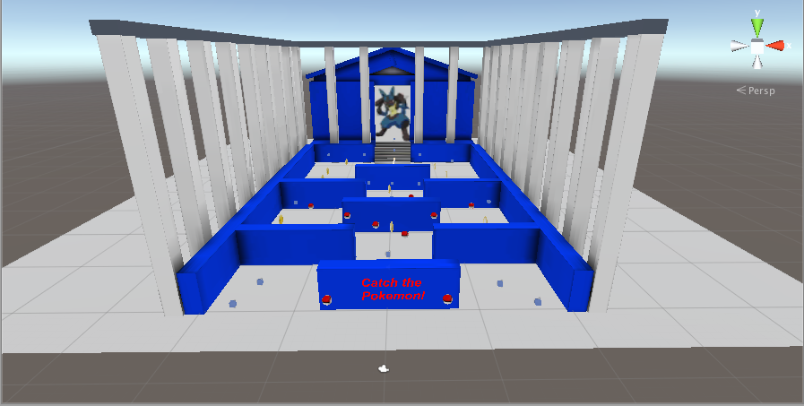

Carl Gosselin

# UDACITY - Virtual Reality Nanodegree

# Pokemon Maze

 [click <a target="_new" href="https://youtu.be/iQ629q8PzuQ">here</a> to view video of game]

### Duration of project:  1 week
### Biggest Challenge:  Raising the door.  
I dragged & dropped the prefab door as opposed to the door in the scene.  
Someone else had the same issue in the forum and provided the resolution.

## Project Overview

This project is focused on learning to code the scripts that bring everything to life. Skills include:

Creating new C# scripts in Unity 
If then, loops, arrays, and other programming constructs 
Attaching scripts to objects 
Using the built-in Monobehaviour methods 
Triggers and Gaze Based Interaction 
Creating, moving and animating objects procedurally 
Familiarization with the Unity documentation 
Scripting Dynamic UI Objects 
Debugging 
The Unity Event System. 
Managing and Reloading scenes. 
Controlling particle systems. 
Create an Audio Clip and playing sounds. 
Waypoint Navigation System. 
Profiling scenes for performance. 

## The final VR application

The final VR file is located in the "build" folder and has an extension of "apk" for Android deployment.

## Install

Move the "PokemonMaze.apk" file to your favorite Android device and enjoy the experience.

