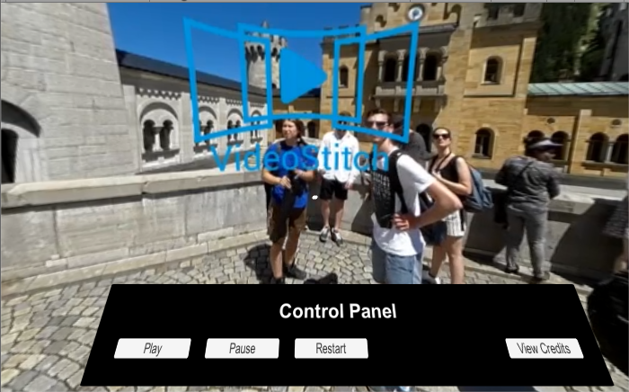

Carl Gosselin

# UDACITY - Virtual Reality Nanodegree

# 360 Video Castle View

	
	 
	[click <a target="_new" href="https://youtu.be/sEXKbMyfr8g">here</a> to view video of castle in Germany]

 

## Project Overview
In this project, the goal is to use either the provided footage, or footage you shot yourself, to create a new and interesting 360 video. 
Utilizing the skills that you have learned in this course and the last, you must stitch together raw footage as flawlessly as possible. 
From there, you must then create some kind of story with interaction in Unity. Use Premiere to edit your stories and audio and stylize your footage with color and effects.

## Summary
This project took me three weeks (on and off) to complete.  The project needed the assistance of many externel technology tools:
1. A tool to stitch 180 degree movies together.  I chose Video Stitch for this purpose.
2. A tool to sequence different 360 videos together.  I chose Adobe Premiere CC for this purpose.
3. A service that could stream 360 videos through the Unity app.  I chose DropBox for this purpose.  
4. A solution that could view and manipulate a 360 movie within Unity.  I chose the AVPro solution for this requirement.

I found this project a good challenge with all of the many moving parts required to create the final product.  This project was not without its challenges: 
A. I had to take the time to learn many new technologies and understand how everything fit together (e.g. Video Stitch to Adobe Premiere CC etc...).  
B. With Video Stitch, I had to learn to create the stitched video with a few custom settings:  stitch video as circular fishbowl, update FOB from 120 to 220, etc...  
C. With Adobe Premiere, I learned that processing the videos in H.264 will save the file with a .MP4 extension  
D. With DropBox, I learned that there is a daily streaming limit of 20GB.  My account got locked on the first day and I had to make a few adjustments to my project.  
E. I learned that a .MOV extension is not compatible with Android devices.  
F. I had a few challenges working the AVPro solution but everything worked out in the end.  
G. I had an issue submitting the final project to Udacity as I exceeding the file limit for submission.  I had over 10,000 files in the project for submission. I reduced it to 345 files by deleting the Library folder.  
H. To improve performance, I reduced the size of my 360 video from 800MB to 100MB.  Application performance was challenged when streaming the 360 video from DropBox.  

## The final VR application

The final VR file is located in the "build" folder and has an extension of "apk" for Android deployment.

## Install

Click <a href="https://github.com/carldgosselin/virtual_reality/tree/master/Project-7-360-Video-CastleView/build">here</a> and move the Castle_in_Germany360 apk file onto your favorite Android device and enjoy the experience.

