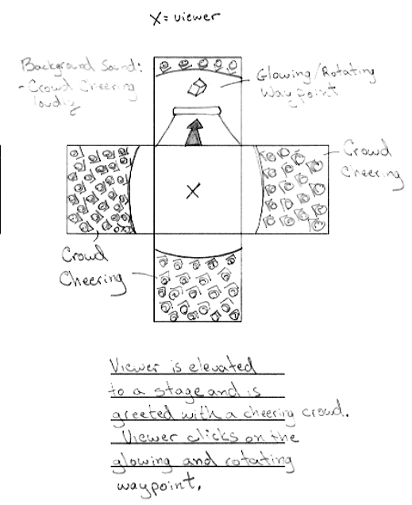

Carl Gosselin

# VR Gallery - SUMMARY AND PROCESS OF WORK

## Introduction

I built a confidence-boosting application as part of Udacity's Virtual Reality Development Nanodegree.  This application took me about X weeks to complete (design, test, build and repeat).
I took a considerable amount of time designing and testing the application early in the process so that I could "fail fast" and make incremental changes throughout the process.
I took the time to conduct multiple rounds of user testing to get early feedback on the virtual environment, the instructional panels, movement from one video to another, and testing the final product.
The multiple rounds of user testing helped in keeping the bugs and scale of changes to a minimum.  The final product is a virtual space with X video booths surrounding the viewer and boosting his/her confidence.  

## Screenshots

 
[click <a target="_new" href="https://youtu.be/KByXvsmKrW8">here</a> to view motivational video/application]

## Statement of purpose
This application is a mobile VR application for people that want to engage in a confidence boosting activity before entering a meeting or attending an social event.

## The Process

### Choosing the ideal persona

For the design of this game, I chose my wife, Andrea, as the ideal persona.

### Choosing the achievements (application features) from Udacity documentation

This capstone project requires the selection of many "achievements" (application features) to be included in the final application to be considered complete.  
You can find the complete list of Udacity "achievements" in this <a href="documentation/030 - Achievements - Udacity Capstone Requirements.docx">document</a>.  
You can review the "achievements" that I've selected for this project <a href="documentation/031 - Identify Achievements for Capstone Project.md">here</a>. 

### Sketches

I sketched the application visuals using a 360 storyboard template...

 
You can view the other storyboard visuals <a href="documentation/040 - You The Man! Storyboard.pdf">here</a>.

### User testing - Environment - Google Cube

**User 1** 

**Question: Please describe what you see** 
**Response:**
1. Looks like I'm standing in some sort of room.  
2. I feel kinda small. 
 
**Outcome:**   
1. No changes required  
2. Increased the height of the camera to make the viewer feel a little taller in the room. 
 
**Question: What do you think is the intent of this scene?** 
**Response:**  
3. I'm seeing an arrow that goes up.  Looks like I have to click on it.  
4. I'm not sure what this application is all about.   
 
**Outcome:**  
3. No changes required.  
4. I added some verbiage to highlight the purpose of this experience which is motivating someone before a big event.  

**Question: How tall you feel when looking down at the scene?** 
**Response:** I feel small in this scene. 
**Outcome:**  I raised the height of the viewer gameobject to make the viewer feel a little taller. 

**Question: Can you describe the mood of the environment?** 
**Response:** I don't know.  Not sure what to think of this. 
**Outcome 1:** Added motivational verbiage and background sound (heartbeat and fans cheering)  
**Outcome 2:** I reduced the background sound of fans cheering to make it feel more realistic of being inside a room.  

### User testing - Environment - On Stage

**User 1** 

**Question: Please describe what you see?** 
**Response:**  
1. I see I'm at some sort of concert with fans cheering.  
2. I see a rotating cube.  Not sure what to to.  
**Outcome:**  
1. No changes required.  
2. I added animation to the cube.  The cube now changes color and changes in scale using a script. User now feels like they should click on it.

**Question: Tell me how tall you feel on stage?** 
**Response:** It feel good.  Like everyone is cheering for me.  However, I feel small here too. 
**Outcome:**  I raised the viewer gameobject to make the viewer feel a little but taller.  

**Question: Please tell me what you would expect to do next?** 
**Response:** Click on the rotating cube.  
**Outcome:** No changes required. 

**Question: Anything else you would like to share?  Any questions you were expecting that I didn't ask?** 
**Response:** No.  
**Outcome:** No changes required. 

### User testing - Environment - In Space

**User 1** 

**Question: Please describe what you see in space?** 
**Response:** I see video panels  
**Outcome:**  No changes required.  

**Question: Do you know what to do here?** 
**Response:** Yes. Looks like I can watch videos.  I guess they are motivational videos to watch before I go back to earth. 
**Outcome:**  No changes required.  

**Question: Are the location of the video panels appropriate?** 
**Response:** No, I really have to look up to watch the videos  
**Outcome:**  I lowered the videos for a more confortable viewing experience.  

**Question: Anything else you would like to share?  Any questions you were expecting that I didn't ask?** 
**Response:** Yes, some of the videos are louder than others.  Can you make these more consistent.  
**Outcome:** I recalibrated the audio of videos.  

### User testing - Navigation - starting location, on stage and in space

**User 1** 
**Question: How do you feel about the starting location of this app?** 
**Response:** It good.  Thinking about it, it's sort of a prep room to reflect before going on stage to the fans.  
**Outcome:** No changes.  

**Question: What do you think you need to do next?** 
**Response:** I think I should click on the arrow to go up.
**Outcome:** No changes required. 

**Question: Now that you are on stage.  How is your viewing experience?** 
**Response:** It looks good.  It's a little dark in some parts of the crowd but ok.  
**Outcome:** I added a few more lights to light up the crowd. 

**Question: What do you think is your next step?** 
**Response:** I think I will click on the rotating cube. 
**Outcome:** No changes required.  

**Question: What is your next step after this?** 
**Response:** Looks like I have a choice to go into space or go underground. 
**Outcome:** No changes required. 

### Breakdown of the final piece (or SOP)

The experience begins with...

The user can navigate to one of the X available video screens.

After...

Placeholder.

After...

Placeholder.

## Additional User testing

I conducted user testing early and frequently to minimize the scale of changes to the application. 
I made an attempt to "fail fast" so that the required changes stayed small.  I conducted four rounds of user testing for this application.

### User testing - Navigation - starting location, booth locations and viewing angles

**User 1** 
**Question: How do you feel about the starting location of this app?** 
**Response:** .... 
**Outcome:** .... 

**Question: Now try to navigate to the first booth on the left.  How did you do?** 
**Response:** ...
**Outcome:** ... 

**Question: Have a look at the first booth.  How is your viewing experience?** 
**Response:** ...  
**Outcome:** ... 

**Question: Try to navigate away from the first booth.  Can you describe this experience?** 
**Response:** ... 
**Outcome:** ...  

**Question: Please go ahead and navigate to the others booths.  Please describe your experience in doing so.** 
**Response:** ... 
**Outcome:** ... 

### User testing - Final product

**Question: What do you think is the first step in this application?** 
**Response:** ... 
**Outcome:** ... 

Action:  Please go ahead and click on a booth number.

**Question: How did you feel about the speed of movement to the booth?** 
**Response:** ... 
**Outcome:** ... 

Action:  Please have a look at the booth.

**Question: How did you feel about the booth itself?** 
**Response:** ...   
**Outcome:** ... 

Action:  Please navigate to the other booths.

**Question: How was your experience visiting the other booths?** 
**Response:** ... 
**Outcome:** ... 

**Question: Anything else you would like to share about this virtual experience?** 
**Response:** ... 
**Outcome:** ... 

### User testing outcomes and iterations

Testing the application early and frequently kept the bugs and changes small and incremental.  
It helped mitigate large mistakes that would have taken a lot of time to resolve if discovered further down the road.
With early user testing, I was able to adjust the height of the game and the speed of movement early in the process.

## Conclusion

This assignment made me realize the importance of establishing a repeatable process for creating a virtual environment.  
It made evident the importance of user testing components of the game early to "fail fast".  
Getting the scale of the game right is important in the early stages of development as re-scaling at the end of the development process can take a lot more time and resources to fix.  
In virtual reality, the scale and speed of movement are core attributes to a good experience.

## How to install

Click <a href="build/">here</a> and move the VR-Gallery apk file onto your favorite Android device and get pumped up for your next event.

