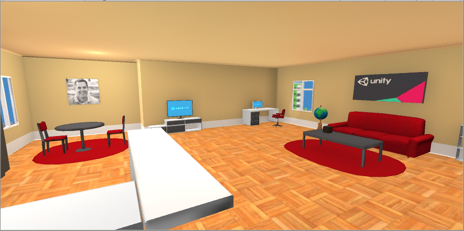

Carl Gosselin

# UDACITY - Virtual Reality Nanodegree

## Please navigate to the project folders for detailed README's for each project.

 

## VR GALLERY - Main Hall
<a href="https://github.com/carldgosselin/virtual_reality/blob/master/Project-5-VR-Gallery/VR Gallery - Summary and Process.md">

</a>

[click <a target="_new" href="https://youtu.be/8mJ6CCGBZAk?t=4s">here</a> to view video of VR Gallery]

## PUZZLER
<a href="https://github.com/carldgosselin/virtual_reality/blob/master/Project-4-Puzzler/PUZZLER - Summary and Process.md">

</a>

[click <a target="_new" href="https://youtu.be/hhSTB7rkNBk">here</a> to view video of game]

## POKEMON MAZE
<a href="https://github.com/carldgosselin/virtual_reality/tree/master/Project-3-Pokemon-Maze">

</a>

[click <a target="_new" href="https://youtu.be/iQ629q8PzuQ">here</a> to view video of game]

## VR APARTMENT
<a href="https://github.com/carldgosselin/virtual_reality/tree/master/Project-2-Build-VR-Apartment">

</a>

 [click <a target="_new" href="https://youtu.be/uLwX9iuOObM">here</a> to view video of virtual apartment]

## MY FIRST VR APP
<a href="https://github.com/carldgosselin/virtual_reality/tree/master/Project-1-My-First-VR-App">

</a>

[click <a target="_new" href="https://youtu.be/OcRyGXIPvRg">here</a> to view video of my first VR app]

