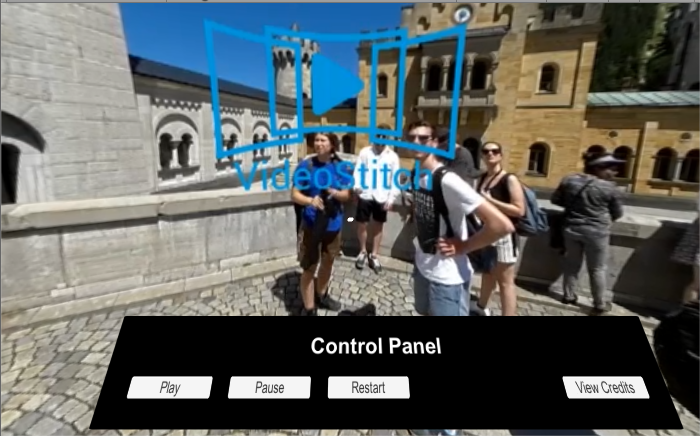
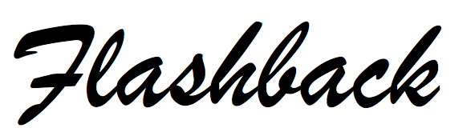
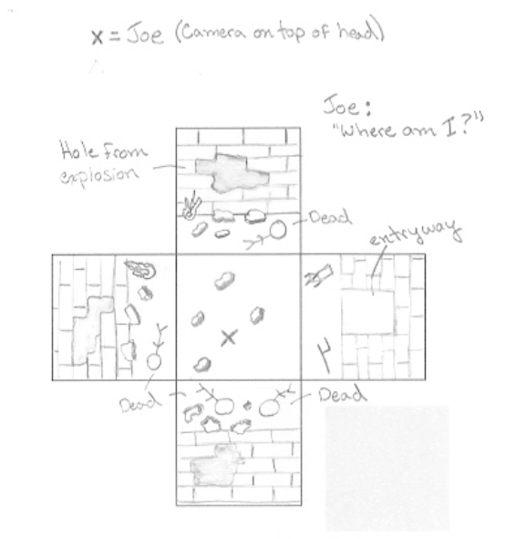

Carl Gosselin

# UDACITY - Virtual Reality Nanodegree

## Please navigate to the project folders for detailed README's for each project.

 

# 360 Video Castle View
<a href="Project-7-360-Video-CastleView">

	

</a>
 

[click <a target="_new" href="https://github.com/carldgosselin/virtual_reality/blob/master/Project-7-360-Video-CastleView">here</a> to go to project folder]

## 360 Video Scripting
<a href="Project-6-360-Video-Scripting">

</a>
<a href="Project-6-360-Video-Scripting">

</a>
 
	[click <a href="https://github.com/carldgosselin/virtual_reality/blob/master/Project-6-360-Video-Scripting/360%20video%20-%20storyboard%20-%20Flashback.pdf">here</a> to view storyboard]
	 
	[click <a href="https://github.com/carldgosselin/virtual_reality/blob/master/Project-6-360-Video-Scripting">here</a> to view project folder]
	 
	[Nominated for Outstanding Project Award]

## VR GALLERY - Main Hall
<a href="https://github.com/carldgosselin/virtual_reality/blob/master/Project-5-VR-Gallery/VR Gallery - Summary and Process.md">

</a>

[click <a target="_new" href="https://youtu.be/8mJ6CCGBZAk?t=4s">here</a> to view video of VR Gallery]
 
[click <a target="_new" href="https://github.com/carldgosselin/virtual_reality/blob/master/Project-5-VR-Gallery/VR Gallery - Summary and Process.md">here</a> to view summary and process of work]

## PUZZLER
<a href="https://github.com/carldgosselin/virtual_reality/blob/master/Project-4-Puzzler/PUZZLER - Summary and Process.md">

</a>

[click <a target="_new" href="https://youtu.be/hhSTB7rkNBk">here</a> to view video of game]
 
[click <a target="_new" href="https://github.com/carldgosselin/virtual_reality/blob/master/Project-4-Puzzler/PUZZLER - Summary and Process.md">here</a> to view summary and process of work]

## POKEMON MAZE
<a href="https://github.com/carldgosselin/virtual_reality/tree/master/Project-3-Pokemon-Maze">

</a>

[click <a target="_new" href="https://youtu.be/iQ629q8PzuQ">here</a> to view video of game]

## VR APARTMENT
<a href="https://github.com/carldgosselin/virtual_reality/tree/master/Project-2-Build-VR-Apartment">

</a>

 [click <a target="_new" href="https://youtu.be/uLwX9iuOObM">here</a> to view video of virtual apartment]

## MY FIRST VR APP
<a href="https://github.com/carldgosselin/virtual_reality/tree/master/Project-1-My-First-VR-App">

</a>

[click <a target="_new" href="https://youtu.be/OcRyGXIPvRg">here</a> to view video of my first VR app]

